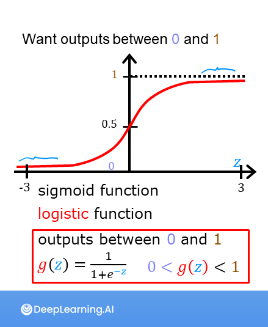
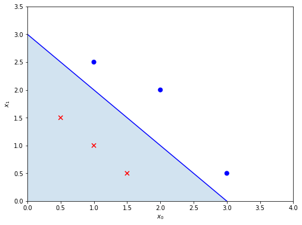

## Classification
In linear regression we have seen examples where what we are trying to predict has infitite values. In classification we would see examples where the output variable has few fixed categories. Lets look at few of the examples:

* Classifing an email as spam or no spam.
* Fraud detection. Marking every transaction as fraud or no fraud.
* Tumor - Classifying tumor as benign or non benign. 

When we are trying to find true/false - also called ***Binary Classifier***. 

From what we have learnt we can try to use linear regression for classification. One way would be:

When `f(x) < 0.5 - Prediction is 0 -> y^ = 0`

When `f(x) >= 0.5 - Prediction is 1 -> y^ = 1`

This might work for few of the examples but in general linear regression is not a very good model for classification. The problem is with every additional data (might be to far right) Linear regression would lead to shift over (changing of decision boundary) which would lead to bad classification.

### Logictic Regression
As we saw Linear regression is not a very good model to be used for classification. Lets intruduce `Sigmoid Function` or `Logistic Function` which would help us to model classification better. 

Sigmoid function is is a s-shape graph which maps every input value to a output value from 0 to 1. The function is defined as:

$g(z) = \frac{1}{1+e^{-z}}\ $

As we can see for a very large z the g(z) would approach near 1 (but never exactly 1) and for very small z values it would approach 0. 

So the process for Logistic Regression is as below:

* We would find the w and b which minimize the cost (this would be explaned later - for now lets assume we have found w and b)
* We would feed it to logistic function for prediction:

$$ f_{\mathbf{w},b}(\mathbf{x}^{(i)}) = g(\mathbf{w} \cdot \mathbf{x}^{(i)} + b ) $$ 

  where

  $g(z) = \frac{1}{1+e^{-z}}\$

#### Interpretation
The way we can interpret the output prediction is - Probability. Lets assume we are using Logistic regression to find if given a size of tumour is it malignant or not. If we get output as 0.7 we can interpret as  - Model has predicted 70% chance of tumor being malignant. 

Here is link of code to see how Sigmoud function looks - [Code Link](https://github.com/satishThakur/data-science/blob/main/machine-learning/classification/sigmoid_function.ipynb) .

### Decision Boundary

* Recall that for logistic regression, the model is represented as 

  $$f_{\mathbf{w},b}(\mathbf{x}^{(i)}) = g(\mathbf{w} \cdot \mathbf{x}^{(i)} + b) $$

  where $g(z)$ is known as the sigmoid function and it maps all input values to values between 0 and 1:

  $g(z) = \frac{1}{1+e^{-z}}\tag{2}$
  and $\mathbf{w} \cdot \mathbf{x}$ is the vector dot product:
  
  $$\mathbf{w} \cdot \mathbf{x} = w_0 x_0 + w_1 x_1$$
  
  
* We interpret the output of the model as the probability that $y=1$.
* Therefore, to get a final prediction ($y=0$ or $y=1$) from the logistic regression model, we can use the following heuristic -

  if $f_{\mathbf{w},b}(x) >= 0.5$, predict $y=1$
  
  if $f_{\mathbf{w},b}(x) < 0.5$, predict $y=0$

* As we know, $g(z) >= 0.5$ for $z >=0$

* For a logistic regression model, $z = \mathbf{w} \cdot \mathbf{x} + b$. Therefore,

  if $\mathbf{w} \cdot \mathbf{x} + b >= 0$, the model predicts $y=1$
  
  if $\mathbf{w} \cdot \mathbf{x} + b < 0$, the model predicts $y=0$  

* Hence the line here  $\mathbf{w} \cdot \mathbf{x} + b >= 0$ becomes the `Decision Boundary`. Any values to the left of the line would be false and to the right would be true.

Please note that if we use polynomial function instread of linear we can get much complex decision boundaries for example circle, ecplipe etc.

