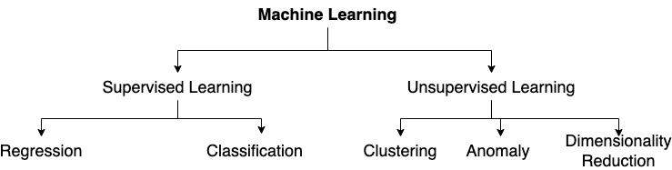

# Introduction to Machine Learning

### What is Machine learning?
Ability for computers to learn on their own without explicitly being programmed. 

Types of Machine Learning:
* Supervised Machine Learning
* Unsupervised Machine Learning

### Supervised Machine Learning
In supervised learning the system leans from the examples. The examples which map input X to Y (label) - using this data where we have already identified the right answer (Y or the label) the algorithm would learn to predict Y from unseen X.
In supervised learning when the goal is to predict Y (which can have infinite possible values) is called Regression. 
Few examples:
* Predicting price of a house in a location, provided data which has prices of already sold house.
When the goal is to predict Categories which are finite in number the Supervised learning is called "Classification". Note that the categories does not need to be numeric. Few examples:

* Predicting weather cancer is beneign or not based on the data.
* Spam filter - classifying email as a span or not.
* Content moderation - claddifying content as fit or not fit.

### Unsupervised Machine Learning
As in supervised learning the data is already labeled with y (the output), in contrast in unsupervised learning data is not labeled. The algorightm tries to find pattern within the data. One typical class of unsupervised learning is "Clustering" for example: Google news which cluster the realted articles together. 
Another class of unsupervised leatning is "Anomaly detection". Examples could be "Froud detection".
Unsupervised learning is also used for "Dimentionality Reduction" - compressing data to fewer data set without compromising the kowledge. 

## Example Linear Regression

### Common Terminology in ML
* ***Training Set***  - Data used to train the model. In case of supervised the data would have both x and y.
* ***Input Variable or Feature*** The input part of data (x) which is used to predict output. Generally denoted by x.
* ***Output or Target Variable*** Y - which we are trying to predict
* ***m*** Number of training examples.

Just to get our intution lets take an example of linear regression (a type of regression):
A regression model takes the training set as input and train the algorithm which outputs a function f which is of shape:
$$ f_{w,b}(x) = wx + b \tag{1}$$
Which means we would try to fit a linear line to predict the output values. We have taken example where we have price of house given the size of the house. We will use linear regression to train the model and get the function f.
Code sample for the same can be found at - [link](https://github.com/satishThakur/data-science/blob/main/machine-learning/coursera-ml-course/week1-intro/linear-regression.ipynb)

## Cost Function

As we have seen in linear regression we try to fit a line which is close to the training set. Cost function measures how well our model works or how well the line fits. As different values of w and b would produce different lines our goal is to find the value of w and b which is the best fit.
What does it mean to be best fit? Thats where cost function comes in to play. The value of w and b which minimizes the cost function would best fit the model.
There are multiple cost functions used but one of the common one is called ***Square Error Cost Function*** and is defined as:

$$J(w,b) = \frac{1}{2m} \sum\limits_{i = 0}^{m-1} (f_{w,b}(x^{(i)}) - y^{(i)})^2 \tag{1}$$ 
where 
  $$f_{w,b}(x^{(i)}) = wx^{(i)} + b \tag{2}$$
  
- $f_{w,b}(x^{(i)})$ is our prediction for example $i$ using parameters $w,b$.  
- $(f_{w,b}(x^{(i)}) -y^{(i)})^2$ is the squared difference between the target value and the prediction.   
- These differences are summed over all the $m$ examples and divided by `2m` to produce the cost, $J(w,b)$.  

To summarize:

our model is $$f_{w,b}(x) = wx + b $$

our parameters are w and b

Cost function is $$J(w,b) = \frac{1}{2m} \sum\limits_{i = 0}^{m-1} (f_{w,b}(x^{(i)}) - y^{(i)})^2 \tag{1}$$ 

Out goal - find value of w and x which minimizes cost function.
