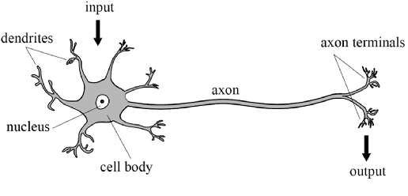
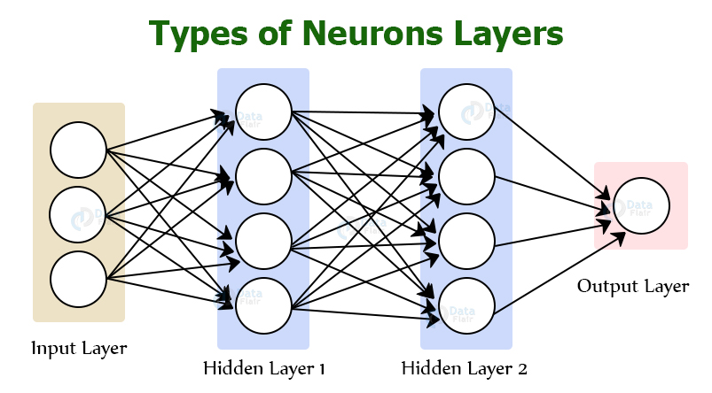

# Neural Networks

Neural Networks are also called Deep Learning systems. Historically Neural network started with mimicing biological brain (neurons which are basic units). Though the motivation has been human brains but neural networks have diverged from biological brains (which is not surprising given we know very little about human brain). 
Few areas where neural network has shown significant promise are:
* Speech recognision.
* Computer vision
* NLP

## Biological Motivation

Biological Neoron has inputs called dendrites (through which it gets the input signal or activation). Neuron has a cell body. The output of a neuron is transmitted via axon which would be input to other neurons. 

The mathematical neuron is extremely simplified model of human neuron. Infact it has shifted a lot from the biological counterpart. The neuron can be represented as:

## Why Deep Learning Now?
* Traditional AI does not sclae with data. What it means is traditional AI does not become better as more and more data is available.
* Deep learning scales with data. As more data is available, medium and large neural networks keep performing better.
* Development in computation power - with powerful GPU/CPU the ability to process large deep leanrning networks.

## How Neural Network Works?

Lets take an example of demand prediction. Given input features like - price, material, color etc we need to predict if the shirt would have high demand. The typical neural network for the same might look like:

The way to think about is:
* Input Layers are the input features to the model.
* The hidden layers are the one where model does feature engineering. Which means it combines one of more input features (with appropriate weight) and create high level features which are better predictors of the output.
* The output layer is the one which decides on prediction. 

Same intution can be applied to image processing where the goal is to find if image is for person xyz. Here:
* Input Layer would be invidual pixel value of the image.
* Multiple hidden layers which build on last layer.
* Output Layer which predicts.

## Neural Network Layers

* The input feature is also called Layer 0. This contain the vector containing values for different features. For example if we have N features then the vector would have size N.
* All the layers between input and output are called Hidden Layers. Reason being hidden layers do the feature engineering which are hidden (or unknown) to us. Like in diagram above we have 2 hidden layers - Layer 1 and Layer 2.
* Every Layer can have N neurons. In diamgram above both layer 1 and layer 2 have each 4 Neurons.
* Every output (called as activation) from previous layer goes to ever neuron in next layer. For example the feature vector from Layer 0 would go as input to all four neuron of Layer 1. Every neuron in a layer would have its own model parameter weights and bias (w and b). So every neuron would apply the activation function for example sigmoid and produce output. Outputs from all neuron from a layer are combined in a vector called activation. This is now input to next layer.
* Output Layer in above example has just one neuron (it can have many as well) - here the result would be the prediction. In case activation function is sigmoid the prediction would be from 0 to 1. If we want to convert it to true/false prediction we can (based on threshold). 

## Code Examples
* [Linear Regression Using Neural Network]()
* [Logistic Regression using Neural Network]()
* [Forward Propagation Using tensorFlow]()
* [Python implementation of forward propagation]()
